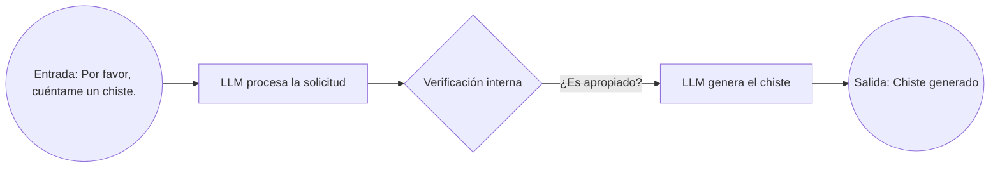

# Planificador de Viaje con IA

## Contexto del Problema

Imagina que el Banco Davivienda desea desarrollar una herramienta que ayude a sus usuarios a planificar un viaje de la manera más completa posible, con el propósito de presentar la información requerida a una embajada. Este plan debe abarcar la compra o reservación de tiquetes, la definición de fechas de viaje, la selección de tours, alojamientos y cualquier otro elemento que la embajada exija para justificar el viaje.

La complejidad surge al coordinar cada detalle para cumplir con los requisitos específicos de la embajada. Además de comprar o reservar los tiquetes, es necesario garantizar que las fechas sean coherentes, las actividades turísticas estén bien justificadas y el itinerario completo se documente de forma clara. Con tantas variables y pasos, pueden surgir dudas sobre el orden de las tareas, las herramientas a utilizar y cómo organizar todo para presentarlo de manera convincente.

Este proyecto busca ayudar en el análisis y organización de las tareas que los usuarios necesitan completar para armar su plan de viaje. Para ello, se apoya en la capacidad de los Modelos de Lenguaje (LLMs) para descomponer la información y generar un flujo de trabajo ordenado, adaptándose a los patrones de comportamiento del usuario y ofreciendo sugerencias que faciliten la presentación del itinerario ante la embajada.


## Orientación para Abordar la Tarea

Ahora, piensa en cómo combinarías varios Modelos de Lenguaje (LLMs) o múltiples interacciones con un mismo LLM para enfrentar este tipo de problema:

- ¿De qué manera aprovecharías diversas respuestas o perspectivas que ofrezca el modelo?
- ¿Qué subtareas o aspectos del problema asignarías a diferentes consultas o instancias del LLM?
- ¿Cómo integrarías estas distintas respuestas para obtener un panorama claro y organizado que facilite el avance de la tarea?

### Ejemplo Gráfico (Usando Mermaid)

Para ilustrar de manera sencilla cómo funcionaría un LLM frente a una tarea puntual, podemos usar el ejemplo de "contar un chiste".



#### ¿Qué es LangChain?
LangChain es una biblioteca en Python que facilita la creación de flujos de trabajo (cadenas) para interactuar con modelos de lenguaje. Permite combinar diferentes componentes —como prompts, modelos y herramientas externas— con el fin de construir aplicaciones que aprovechen de manera óptima las capacidades de los LLM.

#### ¿Qué es un Prompt?
Un prompt es la instrucción o mensaje de texto que se envía al modelo de lenguaje. En pocas palabras, indica al LLM qué se le está pidiendo, brindándole el contexto y las guías necesarias para generar una respuesta coherente.

#### Ejemplo de uso con LangChain

Para poner este flujo en práctica, podrías usar la librería [LangChain](https://github.com/hwchase17/langchain) de la siguiente manera:

```python
from langchain.llms import OpenAI

# Inicializa el modelo (ej. GPT-3, GPT-4, etc.) con tu llave de API.
llm = OpenAI(api_key="TU_API_KEY")

# Define el prompt que representa la entrada "Por favor, cuéntame un chiste."
prompt = "Por favor, cuéntame un chiste."

# Envía la solicitud al LLM
response = llm(prompt)

# Imprime la respuesta generada
print(response)
```

En este pequeño ejemplo, el LLM sólo recibe la entrada ("Por favor, cuéntame un chiste") y genera una respuesta directa sin realizar un paso de verificación o filtrado. Por ello, no se alinea totalmente con el diagrama de verificación interna mostrado arriba, donde se ilustra un proceso más completo. 

Para emular una verificación interna (como se ve en el diagrama), se podrían añadir pasos adicionales en LangChain que analicen si la solicitud del usuario es adecuada o cumple con ciertas políticas, antes de generar la respuesta final. De esta forma, el flujo se parecería más al representado en el diagrama y se ajustaría mejor a un sistema de control y moderación de contenidos.

## Objetivo del Ejercicio

El objetivo de esta prueba técnica es que, con base en la situación descrita, diseñes de forma creativa una estrategia o flujo de trabajo que permita abordar y resolver el problema planteado. Deberás elaborar un diagrama (por ejemplo, usando Mermaid) o una secuencia de pasos para:

1. Descomponer el problema principal en tareas o sub-problemas más pequeños.
2. Determinar cómo podrían interactuar uno o varios LLMs para dar soporte en cada sub-problema.
3. Integrar las respuestas o soluciones generadas, a fin de diseñar un flujo de trabajo coherente y centrado en evitar la procrastinación.

Se evaluará tu capacidad para:

- Pensar críticamente y organizar información compleja.
- Fundamentar cómo y por qué emplearías LLMs o herramientas similares en distintas fases del proceso.
- Presentar tu propuesta de manera clara, ya sea en forma de diagrama Mermaid o a través de una lista de pasos organizados.

## Entregable

El entregable final deberá ser un _notebook_ en Python que implemente la estrategia diseñada. Para ello, se recomienda hacer uso de la documentación oficial de LangChain disponible en:

[https://python.langchain.com/docs/tutorials/llm_chain/](https://python.langchain.com/docs/tutorials/llm_chain/)

Dentro de este _notebook_, deberás:

- Explicar paso a paso la lógica detrás de tu propuesta.
- Integrar las subtareas y la secuencia de consultas a uno o varios LLMs.
- Mostrar cómo se aprovecharía LangChain para desarrollar el flujo de trabajo.

Así, demostrarás tu capacidad de combinar teoría y práctica para abordar problemas complejos haciendo uso de modelos de lenguaje.

